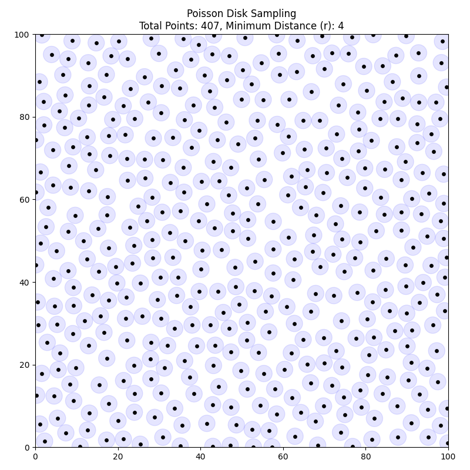
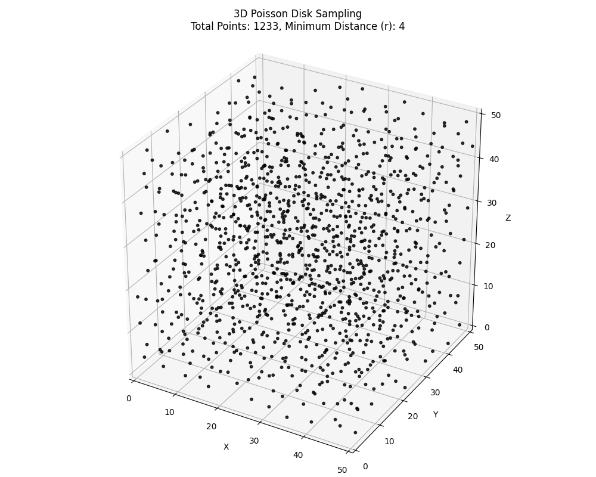

# Poisson Disk Sampling

Python implementations of 2D and 3D Poisson disk sampling using Bridson's algorithm.

## Description

Poisson disk sampling is a method for generating spatially distributed point sets where samples maintain a minimum distance from each other. This project provides efficient implementations for both 2D and 3D cases.

### Features

- **2D Sampling** ([possion_disk_sampling2d.py](possion_disk_sampling2d.py)): Generate evenly-spaced points in a 2D rectangle
- **3D Sampling** ([possion_disk_sampling3d.py](possion_disk_sampling3d.py)): Generate evenly-spaced points in a 3D box
- **Visualization**: Built-in matplotlib visualization for both 2D and 3D results
- **Efficient**: Uses spatial grid acceleration to quickly find neighbor points

## Algorithm

Both implementations use **Bridson's algorithm**, which:

1. Initializes a spatial grid with cell size `r / √n` (where n=2 for 2D, n=3 for 3D)
2. Starts with a random initial point
3. Iteratively generates candidates in an annulus around active points (distance range [r, 2r])
4. Validates candidates to ensure minimum distance constraint
5. Removes points from the active list after k failed attempts

## Usage

### 2D Sampling

```bash
python possion_disk_sampling2d.py
```

Parameters in the script:
- `WIDTH, HEIGHT`: Domain dimensions (default: 100×100)
- `RADIUS`: Minimum distance between samples (default: 4)
- `K`: Maximum attempts before rejection (default: 30)

#### Visualization



### 3D Sampling

```bash
python possion_disk_sampling3d.py
```

Parameters in the script:
- `WIDTH, HEIGHT, DEPTH`: Domain dimensions (default: 50×50×50)
- `RADIUS`: Minimum distance between samples (default: 4)
- `K`: Maximum attempts before rejection (default: 30)

#### Visualization



**Note**: 3D sampling generates points more slowly due to the cubic volume growth. Start with smaller domain sizes.

## Requirements

- Python 3.6+
- matplotlib
- numpy (implicit via matplotlib)

## Installation

```bash
pip install matplotlib
```

## License

MIT License - See [LICENSE](LICENSE) file for details

Copyright (c) 2026 Zhang Yuanxun
